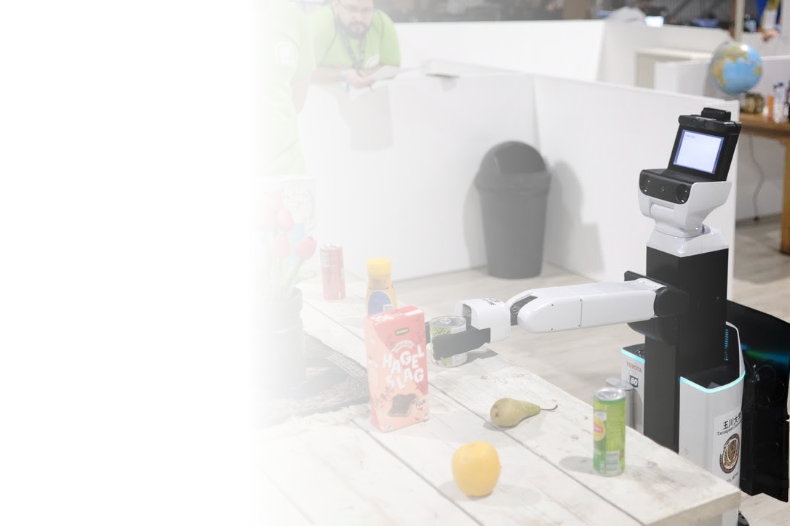

<!-- _paginate: skip -->

TEAM

**eR@sers**

 

 

仲戸川 凱，松前 侑香，能登 稜介，新林 大弥，三次 遼太，
松居 蒼透，坂巻 新，竹中 直哉，水地 良明，西野 順二，稲邑 哲也

<!--
こんにちは．チーム，イレーサーズです．
-->

---

**チーム**

# eR@sers (イレーサーズ)

**生活支援**を目的としたロボットの知能の研究

 

発足
**2000年**

所属
**玉川大学**

RoboCup 2024\*
**準優勝**

<!-- _footer: "*RoboCup 2024 Eindhoven @Home DSPL (世界大会)" -->

<!--
イレーサーズは2000年に発足の，玉川大学に所属する，ロボット競技チームです．
私達は主に生活支援を目的としたロボットの知能の研究を行っています．
また，その検証として主にロボカップ@Homeリーグに参加しています．ロボカップ@Homeリーグは，ロボットが人間の生活空間で家事などの様々なタスクをこなすことを目指すリーグです．
直近のRoboCup 2024では，DSPL部門で準優勝を果たしました．
-->

---

**コンセプト**

# 生活に溶け込むロボットの実現

ハードウェア
**汎用ロボット**
HSR & Kachaka

ソフトウェア
**AI基盤モデル**
単モデルで多様なタスク

**複数ロボットの連携**
人だけでなくロボット間でも

 

<!--
私達のコンセプトは，生活空間に溶け込むロボットの実現です．
そのため，3つの柱を立てています．

1つ目は，ハードウェアです．汎用ロボットHSRとKachakaを用いることで，専用のハードウェアに依存しないロボットを実現します．
また，標準の商品棚をそのまま使ったり，店舗や商品に追加のインフラを設けることなく対応できるようにします．

2つ目は，ソフトウェアです．基盤モデルを活用することで，単一のモデルで多様な環境で様々なタスクをこなすことができるようにします．

3つ目は，複数ロボットの連携です．人との協調はもちろんですが，ロボット間でも協調することで，より社会に溶け込むロボットを目指します．
-->
